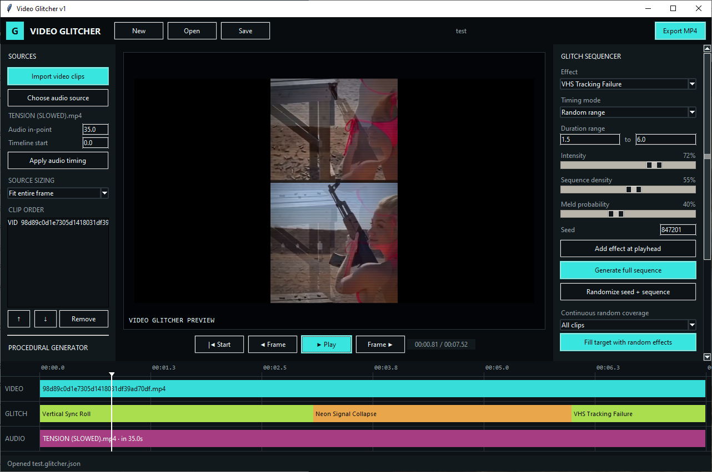
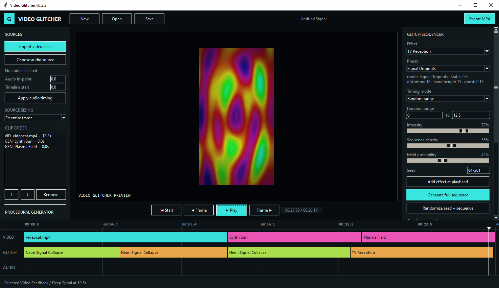
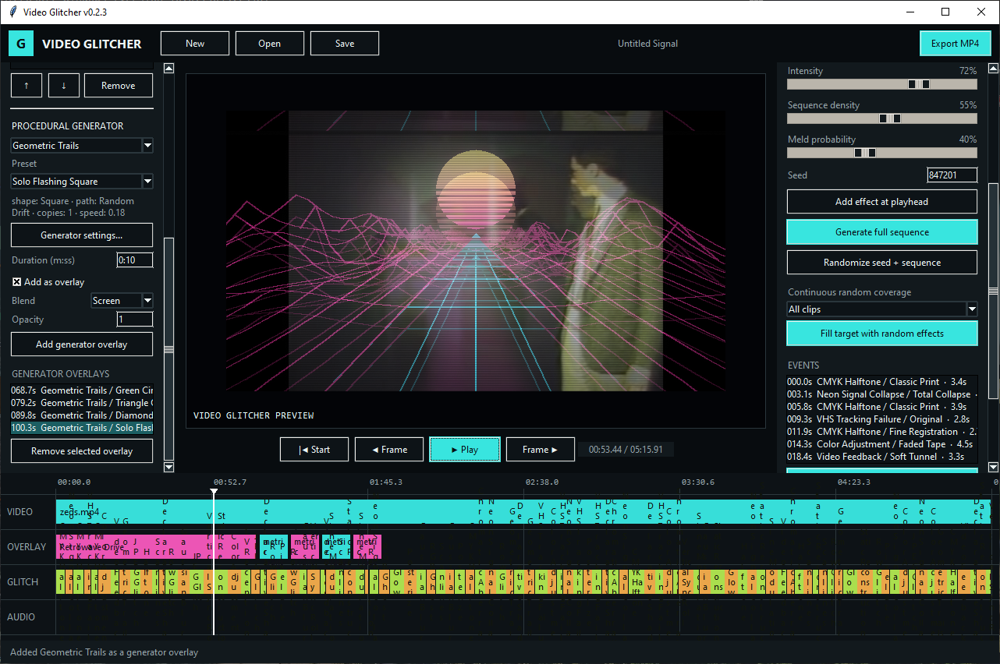

# Video Glitcher v0.2.3


Video Glitcher is a desktop editor for combining video clips, an audio track, procedural retro visuals, and smooth seeded glitch events.







## Included

- Import and reorder multiple video clips.
- Preserve each source's full aspect ratio by default, with optional crop-to-fill or stretch sizing.
- Match a new project's canvas and default export dimensions to its first imported video (for example, a 640×360 source exports at 640×360 by default).
- Confine glitches and CRT processing to the visible source rectangle, leaving letterbox and pillarbox areas untouched.
- Use MP3, OGG, WAV, FLAC, AAC, M4A, or a video's audio stream as the soundtrack.
- Hear the soundtrack during editor playback, including after pausing or seeking.
- Set both the soundtrack's source in-point and its start position on the video timeline.
- Add infinite procedural Neon Grid, Synth Sun, Plasma Field, Analog Static,
  Geometric Trails, and Retrowave Drive video clips.
- Choose generator presets and edit generator-specific settings before adding a
  standalone clip or overlay.
- Select **Add as overlay** to superimpose any generator over the active video
  with adjustable opacity and Normal, Screen, Add, or Multiply blending.
- Apply twenty-one animated retro effects with smooth attack and recovery
  envelopes: the six original Glitcher effects plus fifteen additional
  processors.
- Choose from 71 curated effect presets; every event stores its preset parameters so
  saved projects remain visually stable as defaults evolve.
- Use six TV Reception modes, including full-frame Heavy Snow without an unintended moving wipe boundary.
- Add individual effects at the playhead or generate an entire seeded sequence.
- Continuously fill either the selected clip or every clip with randomized effects that stay inside clip boundaries.
- Replace or reroll individual generated events without changing their position or duration.
- Use fixed duration or a randomized duration range, density, intensity, and meld controls.
- Preview the actual rendering pipeline used by export.
- Save and reopen `.glitcher.json` projects.
- Detect working NVIDIA NVENC, Intel Quick Sync, and AMD AMF H.264 encoders at startup.
- Choose automatic, GPU, or CPU encoding in the export dialog, with automatic CPU fallback if hardware encoding fails.
- Stream rendered frames directly into FFmpeg instead of writing and re-encoding an intermediate video.
- Show the active CPU/GPU encoder, frame progress, elapsed time, and a smoothed time-remaining estimate while exporting.
- Export H.264 MP4 with AAC audio through FFmpeg.

## What's new in v0.2.3

- Added Retrowave Drive with seven presets combining a striped synth sun,
  forward-moving road grid, and animated wireframe terrain.
- Added presets and editable settings to every procedural generator. Generator
  choices are stored with projects and work for both standalone clips and
  overlays.
- Added **Solo Flashing Square** and controls for trail count, path, position,
  motion, size pulsing, flashing, rotation, colors, fill, and glow. A single
  square can now remain fixed, move along a regular path, or use seeded random
  drift while flashing and growing or shrinking.
- Generator duration now accepts seconds, `m:ss`, or `h:mm:ss`; for example,
  enter `4:32` for four minutes and thirty-two seconds. `4;32` is accepted too.
- Added persistent Generator Overlay events and a dedicated timeline track.
  Every procedural generator can now be added over video instead of appended
  as a standalone clip.
- Added an independently scrollable Sources panel and reduced the Clip Order
  list height so procedural generator controls remain reachable on smaller
  displays.
- Added Geometric Trails using animated or static circles, ellipses, squares,
  diamonds, and triangles.
- Added Geometric Trails as a processing effect so multiple shape systems can
  stack over video or generator clips through overlapping effect events.
- Added figure-eight, sine, orbit, Lissajous, diamond-circuit, and static path
  presets with color gradients, size changes, rotation, fading, glow, and
  filled or outlined rendering.

## What's new in v0.2.2

- Faster, single-pass streaming exports with automatic hardware-encoder selection.
- Clear CPU/GPU export status and estimated time remaining.
- Source-sized project canvases and export defaults.
- Corrected full-frame TV static behavior.
- Expanded the processing catalog from the six original effects to twenty effects and 63 presets, with Rain and Snow weather overlays intentionally omitted.
- Added preset selection, parameter summaries, deterministic preset randomization, and per-event preset persistence.

## Effects and presets

- **VHS Tracking Failure:** Original, Loose Tracking, Tracking Storm
- **RGB Ghost:** Original, Soft Echo, Wide Separation
- **Neon Signal Collapse:** Original, Candy Breakdown, Total Collapse
- **Static Reconstruction:** Original, Color Snow, Coarse Rebuild
- **Vertical Sync Roll:** Original, Slow Roll, Hard Flip
- **Video Feedback:** Original, Soft Tunnel, Deep Spiral
- **Glow:** Soft Bloom, Neon Halo, Dream Bloom
- **Chromatic Aberration:** Subtle Fringe, Signal Split, Prism Tear
- **Color Adjustment:** Faded Tape, Cold CRT, Acid Neon
- **Gaussian Blur:** Soft Focus, Analog Smear, Defocus
- **Pixelate:** Fine Pixels, 8-Bit Blocks, Chunky Signal
- **Scanlines:** Fine Display, Classic CRT, Heavy Raster
- **TV Reception:** Weak Reception, Heavy Snow, Horizontal Sync, Rolling Bands, Color Interference, Signal Dropouts
- **Row Glitch:** Light Tearing, Tracking Failure, Digital Break
- **JPEG Glitch:** Compression Haze, Corrupted Tape, Data Collapse
- **Posterize:** Retro Color, Limited Palette, Monochrome Terminal
- **Sine Modulation:** Gentle Ripple, Tape Wave, Signal Melt
- **Halftone:** Fine Print, Newspaper, Pop Art
- **CMYK Halftone:** Fine Registration, Classic Print, Bold Misprint
- **Declarative Shader:** CRT, VHS, Arcade Monitor
- **Geometric Trails:** Green Circle Flow, Blue Square Cascade, Triangle Orbit, Static Concentric Signal, Rainbow Lissajous, Diamond Pulse, Filled Triangle Wave, Solo Flashing Square

## Generator presets

- **Neon Grid:** Classic Neon, Cyan Highway, Magenta Night
- **Synth Sun:** Classic Sunset, Golden Horizon, Electric Blue
- **Plasma Field:** Classic Plasma, Fast Acid, Deep Ocean
- **Analog Static:** Color Static, Monochrome Snow, Coarse Antenna
- **Geometric Trails:** Green Circle Flow, Blue Square Cascade, Triangle Orbit, Static Concentric Signal, Rainbow Lissajous, Diamond Pulse, Filled Triangle Wave, Solo Flashing Square
- **Retrowave Drive:** Neon Sunset Drive, Jagged Night Highway, Neon Canyon, Symmetrical Valley, Morphing Dreamscape, Flat Infinite Grid, Transparent Wireframe

## Requirements

- Python 3.11 or newer.
- Tkinter with Tcl/Tk 8.6 or newer.
- FFmpeg, FFprobe, and FFplay available on the system `PATH`.
- The Python packages listed in `requirements.txt`: OpenCV, NumPy, and Pillow.

## Run

Install the Python dependencies, then launch the application:

```powershell
python -m pip install -r requirements.txt
python run_glitcher.py
```

## First workflow

1. Import one or more video clips, or add a procedural generator clip.
2. Optionally choose a separate audio source.
3. Choose fixed or randomized timing and adjust intensity, density, meld, and seed.
4. Generate a full sequence, then preview or edit individual events.
5. Save the project and export an MP4.

## Current boundaries

- Video clips are concatenated in the displayed order. Source sizing can fit with letterboxing/pillarboxing, crop to fill, or stretch.
- Audio timing is controlled by an audio source in-point and a separate video-timeline start value.
- Clip trimming, partial-range export, draggable events, undo/redo, custom shader files, and GPU effect shaders are not yet implemented.
- Generators and effects are rendered on the CPU. Supported GPUs accelerate H.264 encoding, but effect-heavy 1080p or 60 fps exports can still take longer than real time.
